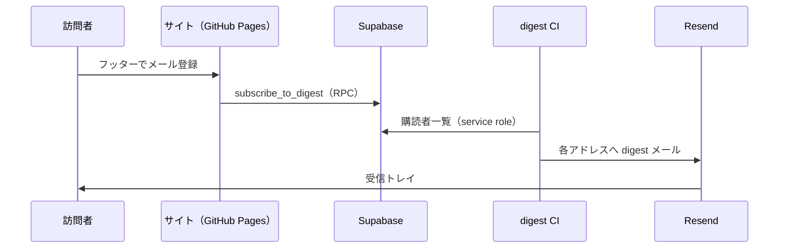

# メール購読（digest 通知）

訪問者がフッターから **メールアドレスを登録** し、平日の digest 公開時に **同じ内容の通知メール** が届く仕組みです（案 A UI + Supabase + Resend）。

## 流れ



## あなたがやること（初回セットアップ）

### 1. Supabase に SQL を実行

**CLI でリンク済みなら**（推奨）:

```powershell
supabase link --project-ref ezmxbbezjebejuizriwf
supabase migration repair 001 --status applied   # 001 を手動実行済みのときだけ
supabase db push --yes
```

**ダッシュボード**なら [Supabase](https://supabase.com/) → **SQL Editor** で [`002_email_subscribers.sql`](../supabase/migrations/002_email_subscribers.sql) を実行。

（`email_subscribers` テーブルと `subscribe_to_digest` 関数ができます）

### 2. `.env`（ローカル）

すでに Good/Bad 用の Supabase があるなら、**追加の公開用変数は不要** です。メール送信だけ足します:

```env
RESEND_API_KEY=re_xxxxxxxx
EMAIL_FROM=Daily Three <onboarding@resend.dev>
EMAIL_TO=あなたのメール@example.com
```

ローカルへ一括反映（キーを **このターミナルだけ** に置く。チャットには貼らない）:

```powershell
$env:RESEND_API_KEY = 're_...'
$env:EMAIL_TO = 'you@example.com'
.\scripts\sync-email-env.ps1
```

確認: `node scripts/verify-subscribe-setup.mjs`

| 変数 | 意味 |
|------|------|
| `PUBLIC_SUPABASE_URL` / `PUBLIC_SUPABASE_ANON_KEY` | フッターの購読フォーム表示・登録（既存） |
| `SUPABASE_URL` / `SUPABASE_SERVICE_ROLE_KEY` | digest CI が購読者一覧を読む（既存） |
| `RESEND_API_KEY` | digest メール送信（**購読者向けに必須**） |
| `EMAIL_FROM` | 差出人（Resend で許可されたアドレス） |
| `EMAIL_TO` | **あなた**への控えメール（任意） |

### 3. GitHub Secrets（本番）

| Secret | 用途 |
|--------|------|
| `RESEND_API_KEY` | digest ワークフロー・購読者への送信 |
| `EMAIL_FROM` | 差出人（任意だが推奨） |
| `EMAIL_TO` | 運営者控え（任意） |
| `PUBLIC_SUPABASE_*` / `SUPABASE_*` | 既存と同じ |

`daily-digest` と Pages デプロイの両方で `RESEND_API_KEY` が digest 実行時に使われます。

### 4. Resend の注意（重要）

- 開発中は `onboarding@resend.dev` から **Resend アカウントに登録したメールアドレスだけ** に送れる場合があります。
- **本番で誰にでも届ける**には [Resend でドメインを認証](https://resend.com/docs/dashboard/domains/introduction) し、`EMAIL_FROM` をそのドメインのアドレスにしてください。

## サイト上の表示

| 条件 | フッター |
|------|----------|
| Supabase 公開キーあり | メール入力 + 「購読する」+ 同意チェック |
| `PUBLIC_BMC_URL` あり | その上に BMC ピル（案 A） |
| Supabase なし | 購読フォームは非表示 |

## 配信停止

現状は DB の `unsubscribed_at` を手動でセットする運用です。訪問者には「GitHub Issues で連絡」とメール末尾に記載しています。

## 関連

- [SUPABASE.md](SUPABASE.md) — 001 マイグレーション・匿名ログイン
- [DEPLOY.md](DEPLOY.md) — CI・Secrets
- [SECURITY.md](SECURITY.md) — API キー
